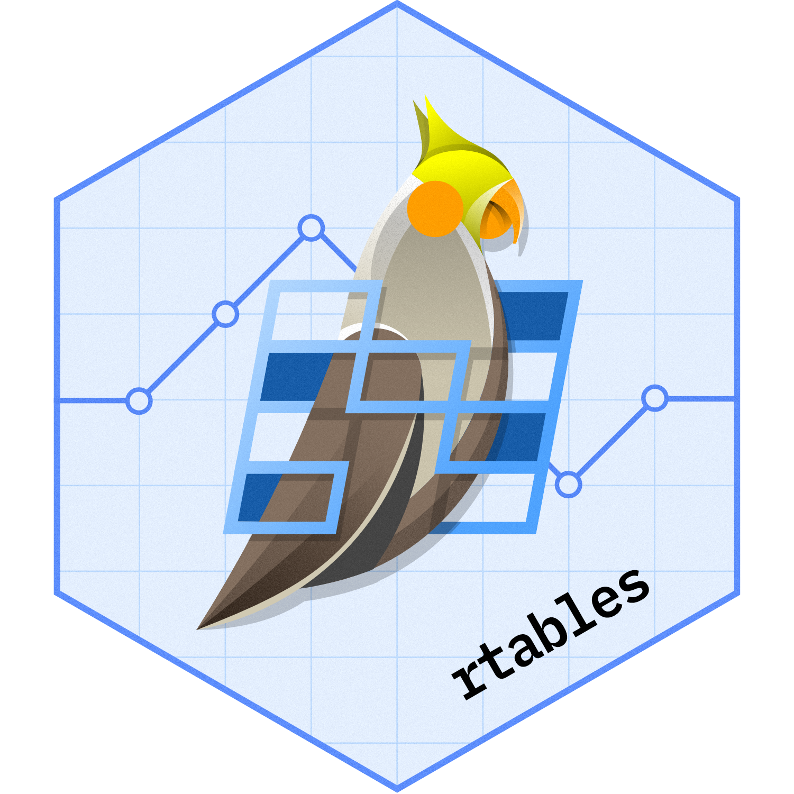

<!-- README.md is generated from README.Rmd. Please edit that file -->

# rtables <a href='https://github.com/insightsengineering/rtables'></a>

<!-- start badges -->

[](https://github.com/insightsengineering/rtables/actions/workflows/check.yaml)
[](https://insightsengineering.github.io/rtables/)
[](https://raw.githubusercontent.com/insightsengineering/rtables/_xml_coverage_reports/data/main/coverage.xml)


[](https://www.repostatus.org/#active)
[](https://github.com/insightsengineering/rtables/issues?q=is%3Aissue+is%3Aopen+sort%3Aupdated-desc)

[](https://CRAN.R-project.org/package=rtables)
[](https://github.com/insightsengineering/rtables/tree/main)
<!-- end badges -->

## Exporting `rtables` to Microsoft Word and beyond

The `rtables.officer` package provides a framework to export tables
created with
[`rtables`](https://github.com/insightsengineering/rtables/) to
Microsoft Word documents. To do so, we use the `officer` package to
create a Word document and the `flextable` package to produce the
intermediary table object that `officer` can use to create the Word
document.

Please refer to the following packages for further information: -
[`rtables`](https://github.com/insightsengineering/rtables/) to create
tables. - [`flextable`](https://github.com/davidgohel/flextable) as an
intermediate html table object. Many aesthetic functionalities are
available at this stage. -
[`officer`](https://github.com/davidgohel/officer) to create Word
documents. Please consider also other exporter options (e.g. `html`)
that are available from `flextable`.

`rtables` and `rtables.officer` is developed and copy written by
`F. Hoffmann-La Roche` and it is released open source under Apache
License Version 2.

## Installation

`rtables.officer` is available on CRAN and you can install the latest
released version with:

``` r
install.packages("rtables.officer")
```

or you can install the latest development version directly from GitHub
with:

``` r
# install.packages("pak")
pak::pak("insightsengineering/rtables.officer")
```
